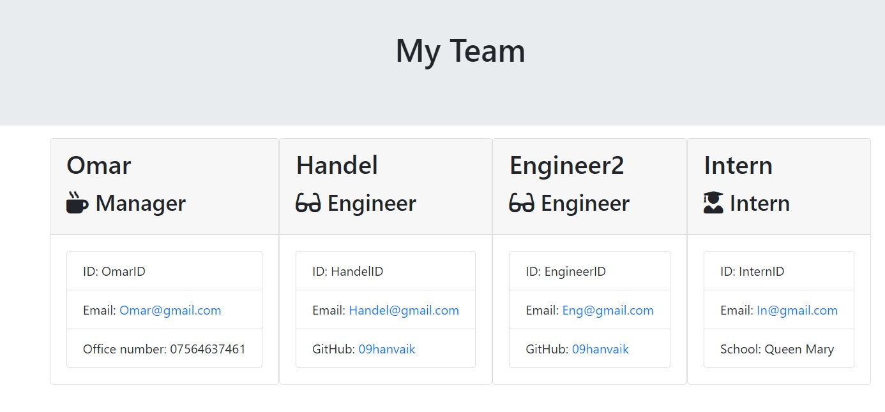

# HTML Profile Generator

## Description

This project is a command-line application that accepts user input to create a basic HTML.
The user story I am trying to follow are below and taken directly from a challenge's description:

## User Story

AS A manager
I WANT to generate a webpage that displays my team's basic info
SO THAT I have quick access to their emails and GitHub profiles

## Example result the application's output

## Installation

You would need to install all packages (via npm install, for example) mentioned in the package.json and run the application using `node index.js`

## Credits

- Skills for Life/EdX FE bootcamp course 2023/24 where User Story is taken from.
- NPM tutorials: https://www.educative.io/answers/how-to-use-the-inquirer-node-package
- Jest Docs: https://jestjs.io/docs/getting-started
